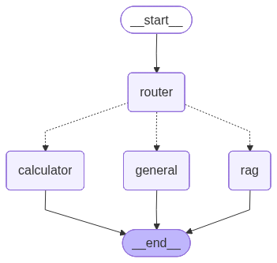

# 🧭 Smart Tool-Routing Assistant

An agent that **decides _how_ to answer a question before answering it**, then
routes it to the right tool:

- **🧮 Calculator** — arithmetic, via a *safe* symbolic evaluator (never `eval()`)
- **📄 Document Search (RAG)** — questions about uploaded files (local embeddings + Chroma)
- **💬 Direct LLM** — everything else

Built as a **LangGraph state machine**: a router node classifies each question
into `MATH` / `DOC_SEARCH` / `GENERAL`, and a conditional edge sends the shared
state to exactly one tool node. The UI always shows **which tool was used and
why**, so the routing decision is visible during a demo.

> Realistic framing: an **internal helpdesk assistant** — employees ask policy
> questions (DOC_SEARCH), quick calculations (MATH), or general queries (GENERAL).

---

## Architecture



> Regenerate with `python -m scripts.render_graph` (no credentials needed).

```
                          ┌─────────────┐
        question  ──────► │  router     │  GPT-4.1 → {tool, reason}
                          │  (node)     │
                          └──────┬──────┘
                                 │  conditional edge on state['tool']
              ┌──────────────────┼──────────────────┐
              ▼                   ▼                   ▼
        ┌───────────┐      ┌───────────┐      ┌───────────┐
        │ calculator│      │    rag    │      │  general  │
        │  (sympy)  │      │ retrieve+ │      │ direct LLM│
        │           │      │  GPT-4.1  │      │           │
        └─────┬─────┘      └─────┬─────┘      └─────┬─────┘
              └──────────────────┼──────────────────┘
                                 ▼
                                END   → Streamlit reads
                                        state['answer' | 'tool' | 'reason']
```

**Shared state:** `{ question, has_documents, tool, reason, context, answer }` —
each node reads what it needs and writes its part
([src/graph.py](src/graph.py)).

Adding a 4th tool later is just **one new node + one new branch** in the
conditional edge.

---

## Project layout

| Path | What it is |
|------|-----------|
| [app.py](app.py) | Streamlit UI — chat, doc upload, "tool used" badge |
| [src/graph.py](src/graph.py) | LangGraph `StateGraph`, nodes, conditional edge |
| [src/router.py](src/router.py) | Router: GPT-4.1 → `{tool, reason}`, robust JSON parse + GENERAL fallback |
| [src/prompts/router_prompt.py](src/prompts/router_prompt.py) | Router prompt, **kept separate** so it can be tuned during eval |
| [src/tools/calculator.py](src/tools/calculator.py) | **Safe** math (sympy, allow-listed symbols) |
| [src/tools/rag.py](src/tools/rag.py) | Chunk → embed (all-MiniLM) → Chroma → retrieve → grounded answer |
| [src/tools/general.py](src/tools/general.py) | Direct GPT-4.1 answer |
| [src/config.py](src/config.py) | Azure OpenAI settings + LLM factory |
| [eval/questions.csv](eval/questions.csv) | 55 labeled questions (MATH / DOC_SEARCH / GENERAL) |
| [eval/evaluate.py](eval/evaluate.py) | Routing accuracy, per-class F1, confusion matrix |
| [sample_docs/company_policy.md](sample_docs/company_policy.md) | Sample doc for the RAG demo |
| [scripts/render_graph.py](scripts/render_graph.py) | Renders the LangGraph diagram to `docs/graph.png` |
| [tests/test_calculator.py](tests/test_calculator.py) | Unit tests incl. code-injection rejection |

---

## Setup

```bash
# 1. Install dependencies
python -m venv .venv
source .venv/bin/activate        # Windows: .venv\Scripts\activate
pip install -r requirements.txt

# 2. Configure Azure OpenAI (local dev)
cp .env.example .env
#   then edit .env with your endpoint, key, api version, deployment
```

**How secrets are loaded** (in priority order, see [src/config.py](src/config.py)):

1. **Streamlit secrets** (`st.secrets`) — used in cloud deploys
2. **Environment variables** — including a local `.env` (auto-loaded via
   `python-dotenv`)

`.env` and `.streamlit/secrets.toml` are **gitignored** — credentials never get
committed. Nothing is hard-coded; the app raises a clear error listing any
missing settings.

| Key | Example |
|-----|---------|
| `AZURE_OPENAI_API_KEY` | `…` |
| `AZURE_OPENAI_ENDPOINT` | `https://your-resource.openai.azure.com/` |
| `AZURE_OPENAI_API_VERSION` | `2024-10-21` |
| `AZURE_OPENAI_CHAT_DEPLOYMENT_NAME` | `gpt-4.1` |

---

## Run the app

```bash
streamlit run app.py
```

Upload [sample_docs/company_policy.md](sample_docs/company_policy.md) in the
sidebar, click **Index uploaded files**, then try:

- `What is 18% of 4,500?` → **MATH** → `810`
- `What is the refund window in the policy?` → **DOC_SEARCH**
- `Explain RAG in one line` → **GENERAL**

---

## Evaluate routing accuracy

The headline metric is **routing accuracy**: of all questions, how many were
sent to the correct tool.

```bash
# Azure creds must be set as env vars (or in secrets.toml)
python -m eval.evaluate --docs
```

This prints overall accuracy + a per-class `classification_report`, lists every
misrouted question, writes `eval/results/eval_results.csv`, and saves
`eval/results/confusion_matrix.png`.

| Metric | How it's computed | Target |
|--------|-------------------|--------|
| Routing accuracy | correct tool / total questions | 0.88 – 0.95 |
| Per-class F1 | `sklearn classification_report` | report all three |
| Confusion matrix | `sklearn confusion_matrix` → PNG | included |

> **Improvement story:** tune [router_prompt.py](src/prompts/router_prompt.py),
> re-run, and report before/after (e.g. `0.84 → 0.92`).

### Tests

```bash
python -m pytest tests/ -q
```

---

## Security note

The calculator **never** passes user text to Python's `eval()`. It normalizes
the phrasing, then evaluates with `sympy.sympify` against an **allow-list** of
math symbols — any other identifier (`os`, `__import__`, `open`, `lambda`, …) is
rejected. See the injection-rejection tests in
[tests/test_calculator.py](tests/test_calculator.py).

---

## Deployment

> ⚠️ **Streamlit does NOT run on Vercel** (Vercel is for serverless/frontend;
> Streamlit needs a persistent Python server).

Deploy free on **[Streamlit Community Cloud](https://share.streamlit.io)** or
**Hugging Face Spaces**:

1. Push to GitHub with `requirements.txt`; keep the vector store small.
2. Deploy via `share.streamlit.io`; add the Azure keys as **secrets**.
3. Add the public URL here and to your resume.

---

## Resume bullet

> Built a tool-routing AI assistant with **LangGraph** (Streamlit + Azure OpenAI
> GPT-4.1, local embeddings + ChromaDB): a router node with conditional edges
> sends each query to a calculator, document-RAG, or direct-LLM node; reached
> **~92% routing accuracy** on a 55-question labeled set, up from ~84% after
> prompt refinement.

## Stretch ideas

- Add a 4th tool node (e.g. date/time) + one branch; re-measure accuracy.
- Add a router confidence score; fall back to GENERAL when unsure.
